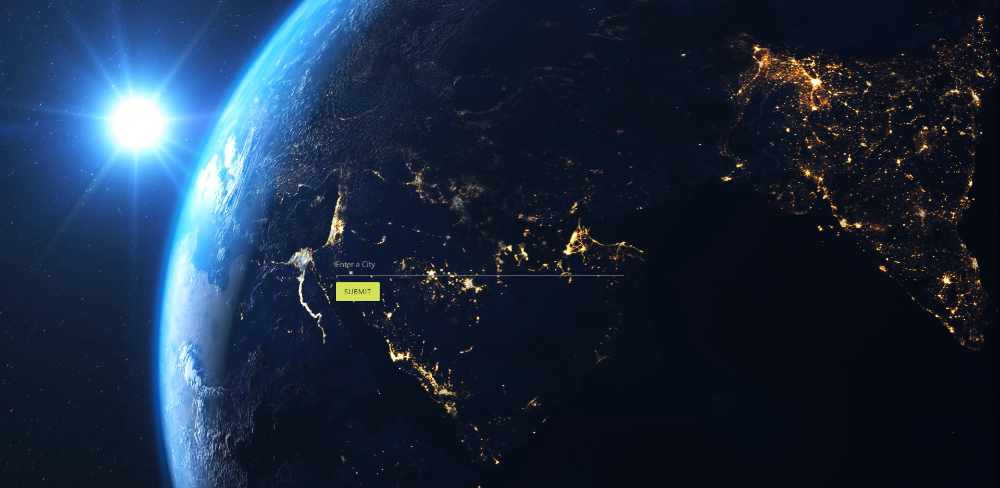
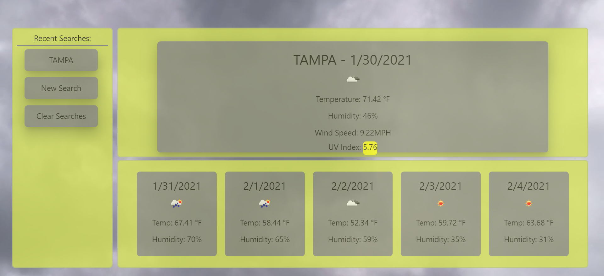

# Weather_Dashboard_NP

## Desciption

This is weather forecast that searches a city anywhere in the world using the openweather api. I added background video for the start with just enter city input. It alerts you and reloads the page if you enter invalid city. Then when you hit enter or click the submit button it does an effect to the forecast for the city, and loads a generic video based on the weather of the city. On the left you see recent searches up to 6, and a new search button and clear searches button. The recent searches are buttons and will search it again. Creatively I decided for it to go back to the earth video then to the new search or old search cit's forecast (I wanted to challenge myself with creativity this week). Then you have current forecast for the city you searched and below an upcoming 5 day forecast.

## Screenshot

## Links

https://nickpodski.github.io/Weather_Dashboard_NP/ - Live URL
https://github.com/Nickpodski/Weather_Dashboard_NP - Git Hub Repo

## Credits

https://www.w3schools.com/ - W3 Schools
https://stackoverflow.com/ - Stack Overflow

